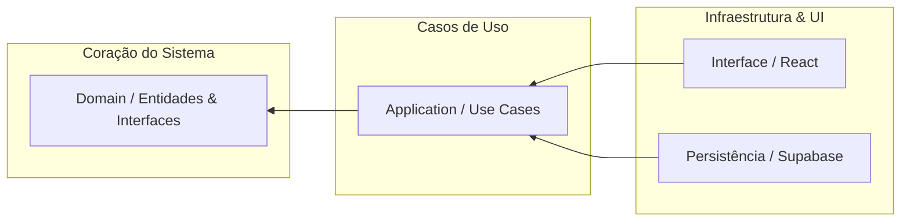

# Açucarada 🍫
> **Sistema de Gestão e Vitrine para Confeitarias Artesanais**

O **Açucarada** é uma plataforma desenvolvida para digitalizar a operação de confeitarias artesanais. O projeto foca em uma arquitetura organizada e sustentável, utilizando conceitos de **Clean Architecture** e garantindo a confiabilidade através de **testes automatizados**.

---

## 🚀 Destaques do Projeto

*   🎯 **Arquitetura Limpa:** Regras de negócio isoladas de dependências externas (banco de dados, UI).
*   🛡️ **Cultura de Testes:** Cobertura de testes unitários para a lógica central da aplicação.
*   📊 **Analytics Integrado:** Acompanhamento de métricas de engajamento em tempo real.
*   ⚡ **Otimização de Performance:** Pipeline para conversão de imagens em WebP e roteamento eficiente.

---

## 🏗️ Arquitetura e Organização

A estrutura do projeto prioriza a separação de responsabilidades, facilitando a manutenção e a evolução do sistema sem impactar o núcleo do negócio.

### Fluxo de Dependências

### Divisão de Camadas

*   **Domínio (`Domain`):** Contém as entidades e as interfaces dos repositórios. É o nível mais alto de abstração e não possui dependências externas.
*   **Aplicação (`Application`):** Implementa os casos de uso (Use Cases) e orquestra o fluxo de dados da aplicação.
*   **Infraestrutura (`Infrastructure`):** Contém as implementações técnicas, como a integração com o Supabase e utilitários de sistema.
*   **Apresentação (`UI`):** Composta por componentes React e páginas que interagem com a camada de aplicação.

---

## 🧪 Qualidade e Testes

A estabilidade do sistema é garantida por uma suíte de testes utilizando **Vitest**:

*   **Testes de Casos de Uso:** Garantem que as regras de negócio funcionem corretamente de forma isolada.
*   **Testes de Componentes:** Validam a integração entre a lógica visual e o estado da aplicação.
*   **Validação de Dados:** Uso do **Zod** para garantir que as informações trafegadas estejam sempre no formato esperado.
*   **Mocking:** Simulação de APIs do navegador para garantir um ambiente de teste consistente.

---

## 🔥 Funcionalidades Principais

### Painel Administrativo
*   **Gestão de Inventário:** CRUD completo de produtos, sabores e categorias.
*   **Gestão de Mídia:** Upload automático para storage com otimização WebP.
*   **Dashboard:** Visualização de métricas de cliques, curtidas e engajamento.

### Área do Cliente
*   **Catálogo Digital:** Interface responsiva e fluida para navegação em produtos.
*   **Fechamento de Pedido:** Canal direto via WhatsApp integrado à vitrine.
*   **Favoritos:** Sistema de interação para produtos favoritos.

---

## 🛠️ Como Executar

1.  **Dependências**: Realize a instalação de todos os pacotes (`npm install`).
2.  **Ambiente**: Configure as variáveis do Supabase no arquivo `.env.local`.
3.  **Execução**: Inicie o servidor de desenvolvimento (`npm run dev`).
4.  **Testes**: Execute a suíte de testes unitários (`npm run test`).
5.  **Linting**: Verifique a padronização do código (`npm run lint`).

---

## 💡 Informações Técnicas

Este repositório demonstra o domínio de ferramentas e padrões de mercado:
1.  **Clean Architecture:** Implementação real de padrões de desacoplamento.
2.  **TypeScript:** Uso consistente de tipagem estática para segurança de código.
3.  **BaaS (Supabase):** Implementação de autenticação, storage e políticas de segurança (RLS).
4.  **Qualidade de Software:** Uso de testes automatizados e ferramentas de análise de código.

---

**Focado em entregar software de qualidade com arquitetura escalável mesmo em pequenos negócios.**  
*Açucarada - Onde o artesanal encontra a tecnologia* 🍫✨
